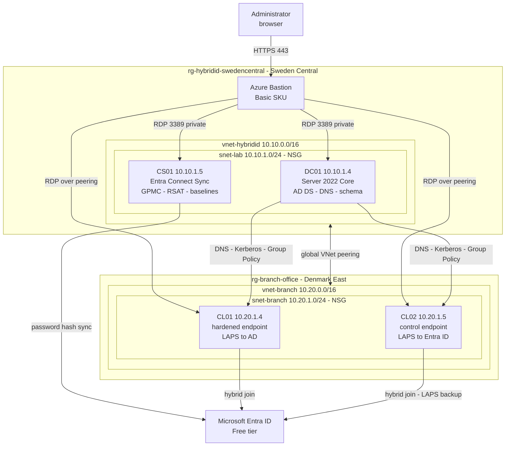

# Forest to Cloud: Cross-Region Hybrid Identity & Infrastructure

An Active Directory forest in Azure, synchronised to Microsoft Entra ID, serving a branch office in
a second region over VNet peering, with hybrid-joined endpoints managed and hardened through Group
Policy, Microsoft security baselines and Windows LAPS.

**All nine phases are built and verified.** The forest is synchronised, the endpoints are
hardened, every local administrator password rotates on its own, and administration is split
into three tiers with enforced logon boundaries. See the
[phase documentation](docs/), [decisions](docs/decisions.md),
[risk register](docs/risk-and-limitations.md) and
[troubleshooting log](docs/troubleshooting/README.md).

The Azure footprint is Terraform, the directory is idempotent PowerShell, and the endpoint
configuration is Group Policy built from cmdlets wherever one exists. The only hand-clicked parts
are the tooling Microsoft ships as a wizard, and the parts of Group Policy that have no cmdlet.

> **Entra ID licence in this project is "Free-tier".** Connect Sync, hybrid Entra join, and Windows LAPS are all included. 
> For further Entra ID hardening see previous project; [Access Control and Identity Governance](https://github.com/sindredg/Access-Control-and-Identity-Governance) which covers CA, PIM, access reviews, etc in Entra.
>[decisions.md](docs/decisions.md).

---

## 1. Architecture

Two sites in two regions joined by global VNet peering. Neither has an internet-facing surface.
Access is over Azure Bastion, and the only inbound NSG rule in each site permits RDP from inside the
virtual network.



No VM holds a public IP. Outbound internet comes from each subnet's default outbound access.

| VM | Site | Image | Private IP | Role |
|---|---|---|---|---|
| DC01 | HQ | Server 2022 Core | 10.10.1.4 | Domain controller, DNS, schema master |
| CS01 | HQ | Server 2022 Desktop | 10.10.1.5 | Entra Connect Sync, GPMC, RSAT, Security Compliance Toolkit |
| CL01 | Branch | Server 2022 Desktop | 10.20.1.4 | Hybrid-joined endpoint. Security baseline applied, LAPS to AD |
| CL02 | Branch | Server 2022 Desktop | 10.20.1.5 | Hybrid-joined endpoint. Baseline control, LAPS to Entra ID |

All `Standard_B2ls_v2`, 2 vCPU and 4 GB, static private IPs. Two clients exist so Phase 6 can
compare a hardened machine against an untouched one and Phase 7 can run both LAPS backends side by
side.

**The second site was not in the original design.** The clients would not fit inside Sweden
Central's vCPU quota and a free trial cannot raise it, so they moved to a peered branch office. That
gave the lab two sites, cross-region DNS and Kerberos, and a real reason for AD Sites and Services.

**One Bastion serves both sites.** The Basic SKU reaches VMs in peered networks, so the host in
Sweden Central connects to the branch clients without a second deployment.

**Auto-shutdown covers HQ only.** It is a `Microsoft.DevTestLab` resource and that provider is not
published in Denmark East, so the branch clients are deallocated by hand.

---

## 2. Tooling

| Layer | Tool | Why |
|---|---|---|
| Azure infrastructure | Terraform `azurerm` | Declarative, diffable, destroys cleanly |
| Forest, OUs, users, groups | PowerShell | Terraform cannot promote a forest, and the `hashicorp/ad` provider is dormant |
| Directory synchronisation | Entra Connect Sync | Cloud Sync cannot do device sync, so it cannot do hybrid join |
| Endpoint configuration | Group Policy | The native mechanism, and the only one available without Intune |
| Security baselines | Microsoft Security Compliance Toolkit | Microsoft ships these as GPO backups, not as code. Imported, then measured with Group Policy Modeling |

Deliberately not used:

| Item | Why not |
|---|---|
| Entra Cloud Sync | No device synchronization, therefore no hybrid join |
| Microsoft Intune | Licence-gated. Group Policy delivers the LAPS policy on hybrid-joined devices without it |
| `hashicorp/ad` provider | v0.5.0, March 2024, dormant, and needs WinRM the Bastion-only design removes |
| VM public IPs | Removed once Bastion was in place |

---

## 3. Repository layout

| Path | Contents |
|---|---|
| `.github/workflows/` | CI: `terraform fmt` and `validate` on every push, no credentials needed |
| `terraform/azure/` | HQ root: network, DC01, CS01, Bastion |
| `terraform/azure-denmarkeast/branch/` | Branch root: own resource group, network, both peering objects, the clients |
| `terraform/modules/windows-vm/` | One VM plus the NIC, disk and shutdown schedule that travel with it |
| `scripts/ad-bootstrap/` | Idempotent PowerShell for the directory layer |
| `cmd-sheets/` | Every command the lab uses, grouped by tool and task |
| `docs/troubleshooting/` | Failures hit during the build, one file per phase, with verbatim error strings |
| `docs/decisions.md` | Choices made, alternatives rejected, what was given up |
| `docs/risk-and-limitations.md` | What this does not do safely, and why |
| `docs/images/phaseN/` | Evidence per phase |
| `PLAN.md` | Phased roadmap and current status |

Three ways to read the same build: the phase documents are the path that worked,
[`cmd-sheets/`](cmd-sheets/README.md) is the copy-pasteable version grouped by tool, and
[`docs/troubleshooting/`](docs/troubleshooting/README.md) is everything that went wrong with the
error strings verbatim so they are searchable.

| Doc | Phase | Status |
|---|---|---|
| [00-infrastructure.md](docs/00-infrastructure.md) | Azure footprint: network, VMs, Bastion | **Complete** |
| [01-ad-environment.md](docs/01-ad-environment.md) | Forest, DNS, domain join, directory | **Complete** |
| [02-entra-connect.md](docs/02-entra-connect.md) | Entra Connect Sync, scoped to one OU | **Complete** |
| [03-branch-network.md](docs/03-branch-network.md) | Second region, peered branch office | **Complete** |
| [04-hybrid-join.md](docs/04-hybrid-join.md) | AD sites, domain join, hybrid Entra join | **Complete** |
| [05-group-policy.md](docs/05-group-policy.md) | Central Store, linked GPOs, verified on the clients | **Complete** |
| [06-security-baselines.md](docs/06-security-baselines.md) | Microsoft baselines, hardened against control | **Complete** |
| [07-windows-laps.md](docs/07-windows-laps.md) | LAPS to Active Directory and to Entra ID | **Complete** |
| [08-tiered-administration.md](docs/08-tiered-administration.md) | Tier 0/1/2 logon boundaries | **Complete** |

---

## 4. What is deployed

**Infrastructure and directory.** Two regions up, forest running, five seed users synchronised into
Entra ID with the `NoSync` OU correctly absent. Both branch clients are Microsoft Entra hybrid
joined, holding an AD identity and a cloud registration at once. `nltest` from a branch client
reports `Our Site Name: Branch-DenmarkEast` against `Dc Site Name: HQ-SwedenCentral`, and DC01
answers across the peering at roughly 16 ms.

**Group Policy (Phase 5).** Central Store serving the domain, three GPOs linked against the OU
structure, one filtered to a single client. Measured rather than asserted: a ping across the peering
that failed before the refresh answers at 16 ms after, while the same ping in the opposite direction
still fails, because CS01 sits outside the OU and receives nothing. A network change would have
fixed both directions, so the asymmetry is what proves Group Policy did it.

**Security baselines (Phase 6).** Microsoft's Server 2022 member server baseline deployed to CL01
and denied on CL02 by security filtering, so the two are directly comparable. CL01 gains two whole
policy categories the control does not have, and stops accepting the shared local administrator
account over Bastion.

**Windows LAPS (Phase 7).** Each client holds its own rotating local administrator password,
delivered by on-premises Group Policy, with CL01 storing its secret encrypted in Active Directory
and CL02 storing its in Entra ID. Retrieving CL01's password as a Domain Admin returns
`DecryptionStatus: Unauthorized`, because it was encrypted to a Tier 1 group. Forest administration
does not confer decryption.

**Tiered administration (Phase 8), in progress.** Tier 0/1/2 OUs, groups and admin accounts exist
outside sync scope, and deny-logon rights enforce the boundary in both directions. A cross-tier
logon returns `1385: the user has not been granted the requested logon type at this computer`,
which is the evidence the phase exists to produce. CS01 was moved out of `CN=Computers`, the
container that no GPO can target, and brought under Windows LAPS, so the credential in Terraform
state no longer opens anything. `labadmin` is retired to break-glass.

Two things the model does not solve. `labadmin` is exempt from every deny rule by design, because
a tier model with no exempt account has no recovery path. And the Azure control plane sits above
all of it: `run-command` executes as SYSTEM without a logon, so subscription rights are forest
rights. Both are entries in [risk-and-limitations.md](docs/risk-and-limitations.md).

---

## 5. Running it

Requires Terraform and the Azure CLI. Run from WSL.

```bash
cd terraform/azure
az login
```

Set `subscription_id` in `terraform.tfvars`. The admin password is deliberately in no file:

```bash
read -rsp 'VM admin password: ' TF_VAR_admin_password && export TF_VAR_admin_password && echo
```

```bash
terraform init && terraform apply
```

Then the branch, which has its own state and `terraform.tfvars`. Apply HQ first: the branch reads
the HQ network through a data source and creates both peering objects.

```bash
cd ../azure-denmarkeast/branch
cp terraform.tfvars.example terraform.tfvars
terraform init && terraform apply
```

Connect with `terraform output bastion_connect_urls` from either root. Tear down with
`terraform destroy`, branch first.

**Start DC01 first, every session.** Both networks point at 10.10.1.4 for DNS, so starting any other
VM while DC01 is deallocated leaves it with no name resolution at all, including for the internet.

**Deallocate the branch clients when you finish.** They have no auto-shutdown schedule, and stopping
from inside Windows still bills:

```bash
az vm deallocate --ids $(az vm list -g rg-branch-office --query "[].id" -o tsv)
```

**Bastion bills hourly.** Set `enable_bastion = false` and apply when you finish a session.

**Both state files hold the admin password in plaintext**, so `terraform.tfstate` and
`terraform.tfvars` are gitignored in every root and must stay that way.
